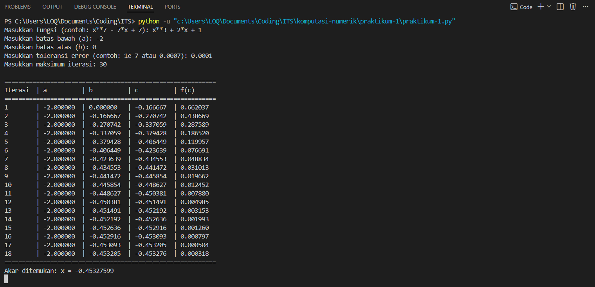
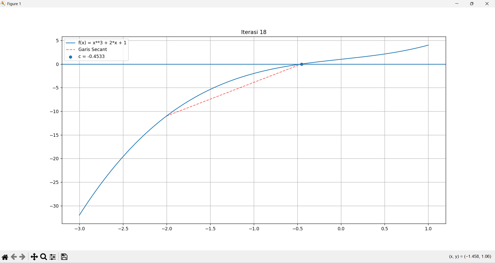

<div align=center>

|    NRP     |           Nama                |
| :--------: |       :------------:          |
| 5025251028 | Julianda Caesar Prkaoso       |
| 5025251046 | Muhammad Fairuz Ananta        |
| 5025251052 | Hilmy Fausta Pratama          |

# Praktikum 1 _(Regula Falsi)_

</div>

## Laporan Praktikum 1

### Langkah-langkah & Potongan Kode

1. Buat file python
```bash
type nul > praktikum-1.py
```

2. Buka dan edit file python 
```bash
code praktikum-1.py
```

3. Import library numpy untuk operasi numerik, matplotlib untuk visualisasi grafik fungsi, dan simpy untuk mengubah input fungsi dalam bentuk string menjadi ekspesi matematika
```py
import numpy as np
import matplotlib.pyplot as plt
from sympy import sympify, symbols, lambdify
```

4. Definisikan fungsi utama yang berisi seluruh proses metode Regula Falsi
```py
def regula_falsi_method():
```

5. Input data
```py
expr_str = input("Masukkan fungsi (contoh: x**7 - 7*x + 7): ")
a = float(input("Masukkan batas bawah (a): "))
b = float(input("Masukkan batas atas (b): "))
tol = float(input("Masukkan toleransi error (contoh: 1e-7 atau 0.0007): "))
max_iter = int(input("Masukkan maksimum iterasi: "))
```

6. Konversi fungsi
```py
x = symbols('x')
expr = sympify(expr_str)
f = lambdify(x, expr, 'numpy')
```

7. Validasi interval, karena metode Regula Falsi mensyaratkan f(a).f(b) < 0
```py
if f(a) * f(b) >= 0:
    print("Metode gagal: Tidak ada perubahan tanda di interval tersebut.")
    return
```

8. Membuat header tabel iterasi
```py
print("\n" + "="*60)
    print(f"{'Iterasi':<8} | {'a':<10} | {'b':<10} | {'c':<10} | {'f(c)':<10}")
    print("="*60)
```

9. Setup grafik dan membuatnya interaktif
```py
plt.ion()
fig, ax = plt.subplots(figsize=(10,6))

x_vals = np.linspace(a - 1, b + 1, 400)
y_vals = f(x_vals)
```

10. Inisialisasi variabel untuk menyimpan nilai pendekatan sebelumnya guna mengecek konvergensi
```py
c_old = a
```

11. Proses iterasi
```py
for iteration in range(1, max_iter + 1):
``` 

12. Perhitungan Regula Falsi
```py
fa, fb = f(a), f(b)

# Rumus Regula Falsi
c = (a * fb - b * fa) / (fb - fa)
fc = f(c)
``` 

13. Output tabel
```py
print(f"{iteration:<8} | {a:<10.6f} | {b:<10.6f} | {c:<10.6f} | {fc:<10.6f}")
``` 

14. Visualisasi grafik
```py
ax.clear()
ax.plot(x_vals, y_vals, label=f'f(x) = {expr_str}')
ax.axhline(0)

# Garis Secant
ax.plot([a, b], [fa, fb], 'r--', alpha=0.6, label="Garis Secant")

# Titik Akar
ax.scatter(c, fc, label=f'c = {c:.4f}', zorder=5)
```

15. Setting tampilan grafik
```py
ax.set_title(f"Iterasi {iteration}")
ax.legend()
ax.grid()
```

16. Update tampilan
```py
plt.draw()
plt.pause(0.8)
```

17. Kondisi berhenti
```py
if abs(fc) < tol or abs(c - c_old) < tol:
    print("="*60)
    print(f"Akar ditemukan: x = {c:.8f}")
    break
```

18. Update nilai
```py
c_old = c

    # Update Interval
    if fa * fc < 0:
        b = c
    else:
        a = c
```

19. Menampilkan grafik akhir
```py
plt.ioff()
plt.show()
```

20. Pemanggilan program
```py
if __name__ == "__main__":
    regula_falsi_method()
```

### Screenshot & Video
- Input & Output


- Grafik
Source video:
`https://drive.google.com/file/d/1SIVxwTsYrHoXD2mA0Oz2P6kQgwpNQ0Wo/view?usp=drive_link` 


### Kode Penuh

```py
import numpy as np
import matplotlib.pyplot as plt
from sympy import sympify, symbols, lambdify

def regula_falsi_method():
    expr_str = input("Masukkan fungsi (contoh: x**7 - 7*x + 7): ")
    a = float(input("Masukkan batas bawah (a): "))
    b = float(input("Masukkan batas atas (b): "))
    tol = float(input("Masukkan toleransi error (contoh: 1e-6 atau 0.0001): "))
    max_iter = int(input("Masukkan maksimum iterasi: "))

    # Konversi ke Fungsi
    x = symbols('x')
    expr = sympify(expr_str)
    f = lambdify(x, expr, 'numpy')

    # Validasi Interval
    if f(a) * f(b) >= 0:
        print("Metode gagal: Tidak ada perubahan tanda di interval tersebut.")
        return

    # Header Tabel
    print("\n" + "="*60)
    print(f"{'Iterasi':<8} | {'a':<10} | {'b':<10} | {'c':<10} | {'f(c)':<10}")
    print("="*60)

    # SetUp Grafik
    plt.ion()
    fig, ax = plt.subplots(figsize=(10,6))

    x_vals = np.linspace(a - 1, b + 1, 400)
    y_vals = f(x_vals)

    c_old = a

    # Iterasi
    for iteration in range(1, max_iter + 1):
        fa, fb = f(a), f(b)

        # Rumus Regula Falsi
        c = (a * fb - b * fa) / (fb - fa)
        fc = f(c)

        # Print Tabel
        print(f"{iteration:<8} | {a:<10.6f} | {b:<10.6f} | {c:<10.6f} | {fc:<10.6f}")

        # Visualisasi
        ax.clear()
        ax.plot(x_vals, y_vals, label=f'f(x) = {expr_str}')
        ax.axhline(0)

        # Garis Secant
        ax.plot([a, b], [fa, fb], 'r--', alpha=0.6, label="Garis Secant")

        # Titik Akar
        ax.scatter(c, fc, label=f'c = {c:.4f}', zorder=5)

        ax.set_title(f"Iterasi {iteration}")
        ax.legend()
        ax.grid()

        plt.draw()
        plt.pause(0.8)

        # Kondisi Berhenti
        if abs(fc) < tol or abs(c - c_old) < tol:
            print("="*60)
            print(f"Akar ditemukan: x = {c:.8f}")
            break

        c_old = c

        # Update Interval
        if fa * fc < 0:
            b = c
        else:
            a = c

    plt.ioff()
    plt.show()

# Main
if __name__ == "__main__":
    regula_falsi_method()
```