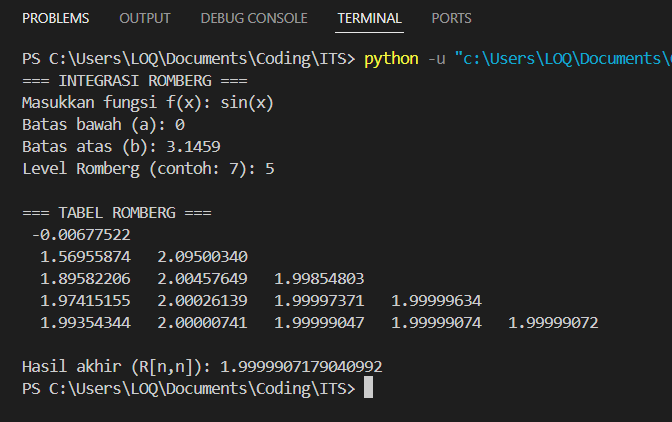

<div align=center>

|    NRP     |           Nama                |
| :--------: |       :------------:          |
| 5025251028 | Julianda Caesar Prkaoso       |
| 5025251046 | Muhammad Fairuz Ananta        |
| 5025251052 | Hilmy Fausta Pratama          |

# Praktikum 2 _(Integrasi Romberg)_

</div>

## Laporan Praktikum 2

### Langkah-langkah & Potongan Kode

1. Buat file python
```bash
touch praktikum-2.py
```

2. Buka dan edit file python 
```bash
code praktikum-2.py
```

3. Import library numpy untuk komputasi numerik dan sympy untuuk parsing fungsi matematika dari input string pengguna
```py
import numpy as np
import sympy as sp
```

4. Fungsi parsing input matematika, mengubah input string menjadi fungsi numerik
```py
def parse_function(func_str):
    x = sp.symbols('x')
    func = sp.sympify(func_str)
    return sp.lambdify(x, func, modules=['numpy'])
```

5. Fungsi Trapezoidal Rule, metode dasar untuk pendekatan integral sebelum dilakukan peningkatan akurasi oleh Romberg
```py
def trapezoidal(f, a, b, n):
    h = (b - a) / n
    x = np.linspace(a, b, n + 1)
    y = f(x)
    return h * (0.5*y[0] + np.sum(y[1:n]) + 0.5*y[n])
```

6. Fungsi utama Romberg Integration, membangun tabel Romberg menggunakan hasil trapezoidal berulang
```py
def romberg(f, a, b, max_level):
    R = np.zeros((max_level, max_level))

    # R(i,0) = Trapezoidal dengan 2^i Interval
    for i in range(max_level):
        n = 2**i
        R[i, 0] = trapezoidal(f, a, b, n)

    # Ekstrapolasi Richardson
    for j in range(1, max_level):
        for i in range(j, max_level):
            R[i, j] = R[i, j-1] + (R[i, j-1] - R[i-1, j-1]) / (4**j - 1)

    return R
```

7. Input data pengguna
```py
func_str = input("Masukkan fungsi f(x): ")
a = float(input("Batas bawah (a): "))
b = float(input("Batas atas (b): "))
level = int(input("Level Romberg (contoh: 7): "))
```

8. Konversi fungsi
```py
f = parse_function(func_str)
```

9. Proses perhitungan Romberg
```py
R = romberg(f, a, b, level)
```

10. Output tabel Romberg
```py
print("\n=== TABEL ROMBERG ===")
for i in range(level):
    for j in range(i+1):
        print(f"{R[i,j]:12.8f}", end=" ")
    print()
```

11. Hasil akhir
```py
print("\nHasil akhir (R[n,n]):", R[level-1, level-1])
``` 

12. Pemanggilan program
```py
if __name__ == "__main__":
    main()
``` 

### Screenshot


### Kode Penuh

```py
import numpy as np
import sympy as sp

# Fungsi User Input
def parse_function(func_str):
    x = sp.symbols('x')
    func = sp.sympify(func_str)
    return sp.lambdify(x, func, modules=['numpy'])

# Aturan Trapezoidal
def trapezoidal(f, a, b, n):
    h = (b - a) / n
    x = np.linspace(a, b, n + 1)
    y = f(x)
    return h * (0.5*y[0] + np.sum(y[1:n]) + 0.5*y[n])

# Integrasi Romberg
def romberg(f, a, b, max_level):
    R = np.zeros((max_level, max_level))

    # R(i,0) = Trapezoidal dengan 2^i Interval
    for i in range(max_level):
        n = 2**i
        R[i, 0] = trapezoidal(f, a, b, n)

    # Ekstrapolasi Richardson
    for j in range(1, max_level):
        for i in range(j, max_level):
            R[i, j] = R[i, j-1] + (R[i, j-1] - R[i-1, j-1]) / (4**j - 1)

    return R

# Output
def main():
    print("=== INTEGRASI ROMBERG ===")

    func_str = input("Masukkan fungsi f(x): ")
    a = float(input("Batas bawah (a): "))
    b = float(input("Batas atas (b): "))
    level = int(input("Level Romberg (contoh: 7): "))

    f = parse_function(func_str)
    R = romberg(f, a, b, level)

    print("\n=== TABEL ROMBERG ===")
    for i in range(level):
        for j in range(i+1):
            print(f"{R[i,j]:12.8f}", end=" ")
        print()

    print("\nHasil akhir (R[n,n]):", R[level-1, level-1])

if __name__ == "__main__":
    main()
```