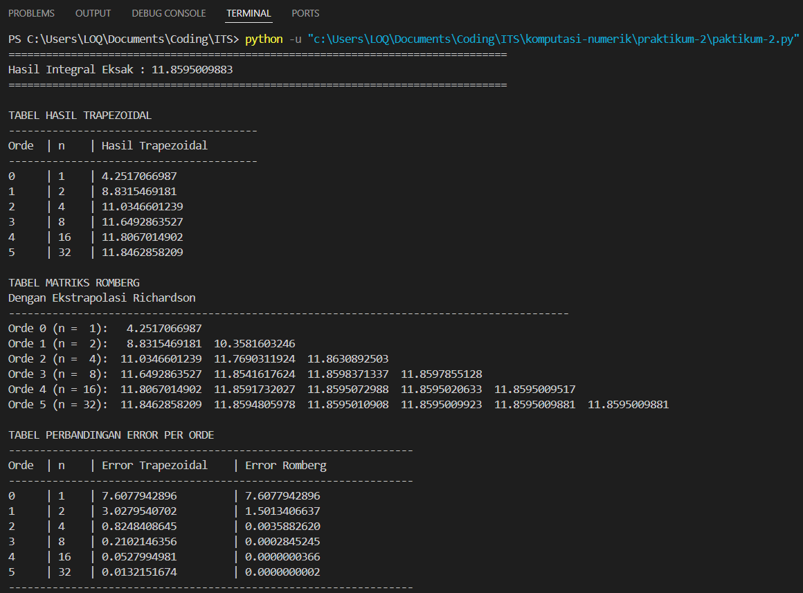
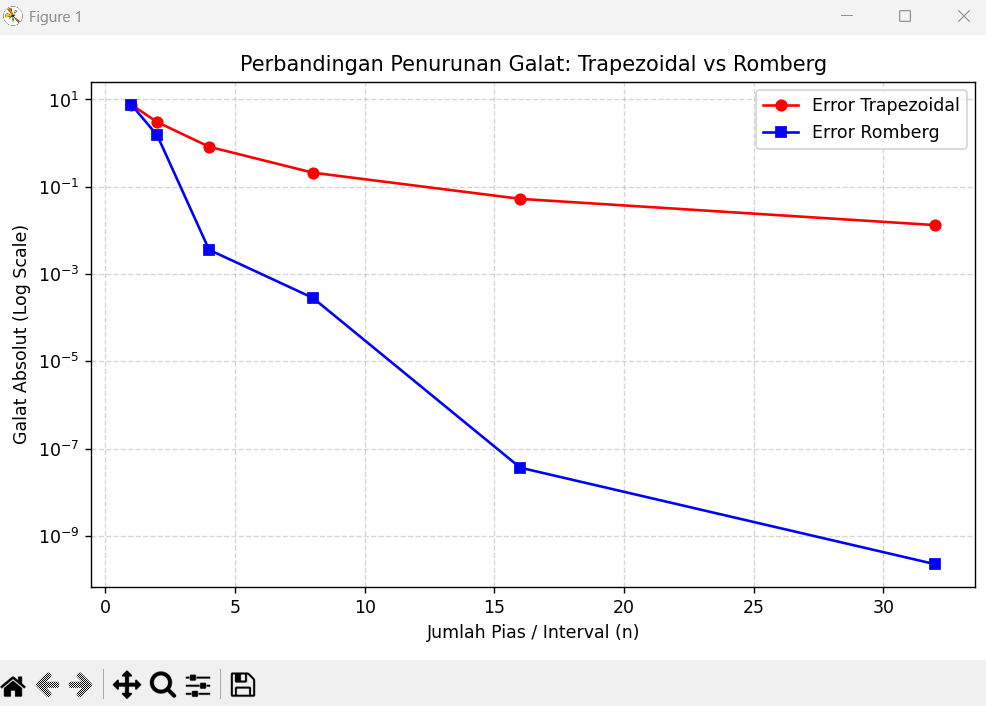

<div align=center>

|    NRP     |           Nama                |
| :--------: |       :------------:          |
| 5025251028 | Julianda Caesar Prkaoso       |
| 5025251046 | Muhammad Fairuz Ananta        |
| 5025251052 | Hilmy Fausta Pratama          |

# Praktikum 2 _(Integrasi Romberg)_

</div>

## Laporan Praktikum 2

### Langkah-langkah & Potongan Kode

1. Buat file python
```bash
touch praktikum-2.py
```

2. Buka dan edit file python 
```bash
code praktikum-2.py
```

3. Import library yang diperlukan untuk komputasi numerik, visualisasi grafik, dan perhitungan nilai integral eksak
```py
import numpy as np 
import matplotlib.pyplot as plt 
from scipy.integrate import quad
```

4. Definisikan fungsi yang akan diintegralkan
```py
def f(x): 
    return np.exp(x) * np.sin(x)
```

5. Buat fungsi Trapezoidal Rule sebagai pendekatan awal integral numerik
```py
def trapezoidal(f, a, b, n): 
    h = (b - a) / n 
    total = 0.5 * (f(a) + f(b)) 
    
    for i in range(1, n): 
        total += f(a + i * h) 
    
    return total * h
```

6. Buat fungsi Integrasi Romberg yang menggunakan hasil Trapezoidal dan Ekstrapolasi Richardson
```py
def romberg(f, a, b, max_level): 
    R = np.zeros((max_level, max_level)) 
    
    for i in range(max_level): 
        n = 2**i 
        R[i, 0] = trapezoidal(f, a, b, n) 
    
    for j in range(1, max_level): 
        for i in range(j, max_level): 
            R[i, j] = R[i, j - 1] + ( R[i, j - 1] - R[i - 1, j - 1] ) / (4**j - 1) 
            
    return R
```

7. Tentukan batas integral dan level Romberg.
```py
a = 0.0 
b = 3.0 
max_level = 6
```

8. Hitung nilai integral eksak menggunakan fungsi quad()
```py
nilai_eksak, _ = quad(f, a, b)
```

9. Bangun tabel Romberg
```py
R = romberg(f, a, b, max_level)
```

10. Hitung galat absolut untuk metode Trapezoidal dan Romberg
```py
error_trapezoidal = [ abs(R[i, 0] - nilai_eksak) for i in range(max_level) ] 
error_romberg = [ abs(R[i, i] - nilai_eksak) for i in range(max_level) ]
```

11. Tampilkan hasil perhitungan berupa tabel Trapezoidal, tabel Romberg, dan tabel perbandingan galat
```py
print("\nTABEL MATRIKS ROMBERG") 
for i in range(max_level): 
    row = f"Orde {i}: " 
    
    for j in range(i + 1): 
        row += f"{R[i, j]:14.10f} " 
        
    print(row)
``` 

12. Visualisasikan perbandingan galat menggunakan grafik skala logaritmik
```py
plt.plot( n_interval, error_trapezoidal, marker='o', label='Error Trapezoidal' ) 
plt.plot( n_interval, error_romberg, marker='s', label='Error Romberg' ) 

plt.yscale('log') 
plt.legend() 
plt.show()
``` 

13. Pemanggilan program utam
```py
if __name__ == "__main__": 
    main()
```

### Screenshot
- Output


- Grafik


### Kode Penuh

```py
import numpy as np
import matplotlib.pyplot as plt
from scipy.integrate import quad

# Fungsi yang Akan Diintegralkan
def f(x):
    return np.exp(x) * np.sin(x)

# Aturan Trapezoidal
def trapezoidal(f, a, b, n):
    h = (b - a) / n
    total = 0.5 * (f(a) + f(b))

    for i in range(1, n):
        total += f(a + i * h)

    return total * h

# Integrasi Romberg
def romberg(f, a, b, max_level):
    R = np.zeros((max_level, max_level))

    # R(i,0) = Trapezoidal dengan 2^i Interval
    for i in range(max_level):
        n = 2**i
        R[i, 0] = trapezoidal(f, a, b, n)

    # Ekstrapolasi Richardson
    for j in range(1, max_level):
        for i in range(j, max_level):
            R[i, j] = R[i, j - 1] + (R[i, j - 1] - R[i - 1, j - 1]) / (4**j - 1)

    return R

# Output
def main():
    a = 0.0
    b = 3.0
    max_level = 6

    # Nilai Eksak Integral
    nilai_eksak, _ = quad(f, a, b)

    # Tabel Romberg
    R = romberg(f, a, b, max_level)

    # Perhitungan Error
    error_trapezoidal = [abs(R[i, 0] - nilai_eksak) for i in range(max_level)]
    error_romberg = [abs(R[i, i] - nilai_eksak) for i in range(max_level)]

    n_interval = [2**i for i in range(max_level)]

    # Output Nilai Eksak
    print("=" * 80)
    print(f"Hasil Integral Eksak : {nilai_eksak:.10f}")
    print("=" * 80)

    # Tabel Trapezoidal
    print("\nTABEL HASIL TRAPEZOIDAL")
    print("-" * 40)
    print(f"{'Orde':<5} | {'n':<4} | {'Hasil Trapezoidal'}")
    print("-" * 40)

    for i in range(max_level):
        print(f"{i:<5} | " f"{n_interval[i]:<4} | " f"{R[i, 0]:.10f}")

    # Tabel Romberg
    print("\nTABEL MATRIKS ROMBERG")
    print("Dengan Ekstrapolasi Richardson")
    print("-" * 90)

    for i in range(max_level):
        row = f"Orde {i} (n = {n_interval[i]:2}): "

        for j in range(i + 1):
            row += f"{R[i, j]:14.10f} "

        print(row)

    # Tabel Error
    print("\nTABEL PERBANDINGAN ERROR PER ORDE")
    print("-" * 65)
    print(f"{'Orde':<5} | " f"{'n':<4} | " f"{'Error Trapezoidal':<20} | " f"{'Error Romberg'}")
    print("-" * 65)

    for i in range(max_level):
        print(f"{i:<5} | " f"{n_interval[i]:<4} | " f"{error_trapezoidal[i]:<20.10f} | " f"{error_romberg[i]:.10f}")

    print("-" * 65)

    # Grafik Perbandingan Error
    plt.figure(figsize=(8, 5))

    plt.plot(n_interval, error_trapezoidal, marker='o', linestyle='-', color='red', label='Error Trapezoidal')
    plt.plot(n_interval, error_romberg, marker='s', linestyle='-', color='blue', label='Error Romberg')

    plt.yscale('log')
    plt.xlabel('Jumlah Pias / Interval (n)')
    plt.ylabel('Galat Absolut (Log Scale)')
    plt.title('Perbandingan Penurunan Galat: Trapezoidal vs Romberg')
    plt.grid(True, which='both', linestyle='--', alpha=0.5)
    plt.legend()
    plt.tight_layout()
    plt.show()

if __name__ == "__main__":
    main()
```